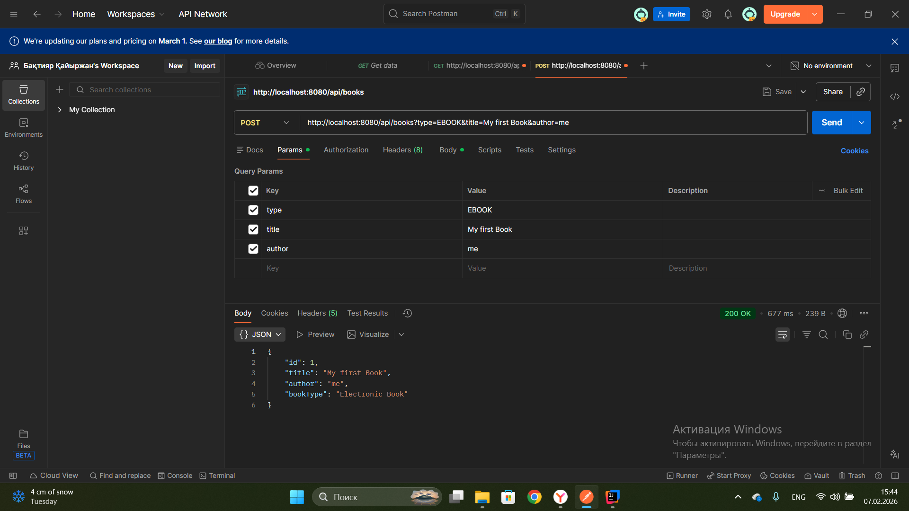
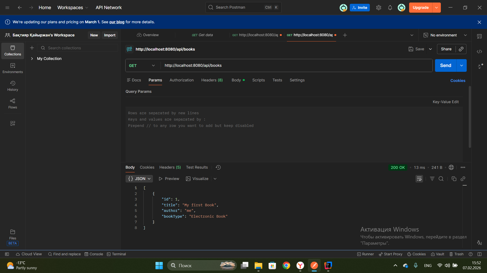
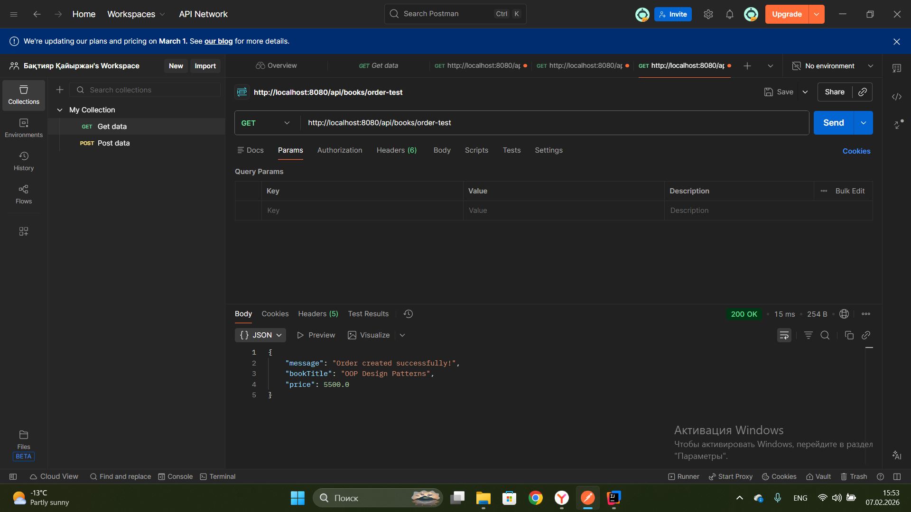
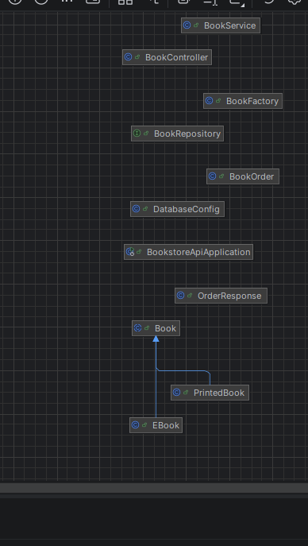

# 📚 Bookstore Management System API

## A. Project Overview

This project is a robust **Spring Boot REST API** for managing a bookstore. It demonstrates advanced software engineering concepts, including **Design Patterns**, **SOLID principles**, and **Component-based architecture**, integrated with a relational database (H2).

---

## B. REST API Documentation

### API Screenshots
#### 1. Creating a book (Factory Pattern)

#### 2. Getting all books

#### 3. Testing Order Builder

### Endpoint List

| Method | Endpoint | Description | Sample Response |
| --- | --- | --- | --- |
| **GET** | `/api/books` | Get all books | `[{"id":1,"title":"Java","author":"Me"}]` |
| **POST** | `/api/books` | Create a book (Factory) | `{"id":1,"type":"EBOOK","title":"Java"}` |
| **GET** | `/api/books/order-test` | Test Builder Pattern | `{"message":"Order created...", "price":5500}` |
| **DELETE** | `/api/books/{id}` | Remove a book | `"Book deleted successfully!"` |

> **Note:** For Postman screenshots, please refer to the `/screenshots` folder or the attached project documentation.

---

## C. Design Patterns Section

1. **Factory Pattern (`BookFactory`)**: Centralizes the creation logic for `EBook` and `PrintedBook`. This decouples the Controller from specific implementations.
2. **Builder Pattern (`OrderResponse.Builder`)**: Provides a flexible way to construct complex API response objects step-by-step without messy constructors.
3. **Singleton Pattern (`DatabaseConfig`)**: Ensures that database configuration settings are instantiated only once throughout the application lifecycle.

---

## D. Component Principles Section

* **CCP (Common Closure Principle)**: Related classes like `Book`, `EBook`, and `PrintedBook` are grouped in the `model` package as they change for the same reasons.
* **CRP (Common Reuse Principle)**: Separated `dto` and `repository` packages ensure that the database layer doesn't depend on unused UI-response classes.

---

## E. SOLID & OOP Summary

* **Inheritance**: Used between `Book` (parent) and `EBook/PrintedBook` (children).
* **Single Responsibility (S)**: Each layer (Controller, Service, Repository) has one specific job.
* **Dependency Inversion (D)**: Service layer depends on the `BookRepository` interface, not a concrete class.

---

## F. Database Schema

The system uses a **Relational Database (H2)**.

* **Table**: `BOOKS`
* **Columns**: `ID` (PK), `TITLE`, `AUTHOR`, `TYPE`, `DTYPE` (Discriminator for inheritance).

---

## G. System Architecture Diagram
The following UML Diagram illustrates the class hierarchy, design patterns (Factory, Builder), and the layered architecture of the system.

---

## H. Instructions to Run

1. Ensure **JDK 17+** and **Maven** are installed.
2. Open the project in **IntelliJ IDEA**.
3. Run the `BookstoreApiApplication` class.
4. Access the API at `http://localhost:8080/api/books`.

---

## I. Reflection Section

This project helped me understand how to transform a simple console application into a professional web service. Integrating Design Patterns within a Spring Boot environment showed me how to write code that is not only functional but also scalable and easy to maintain.

---
